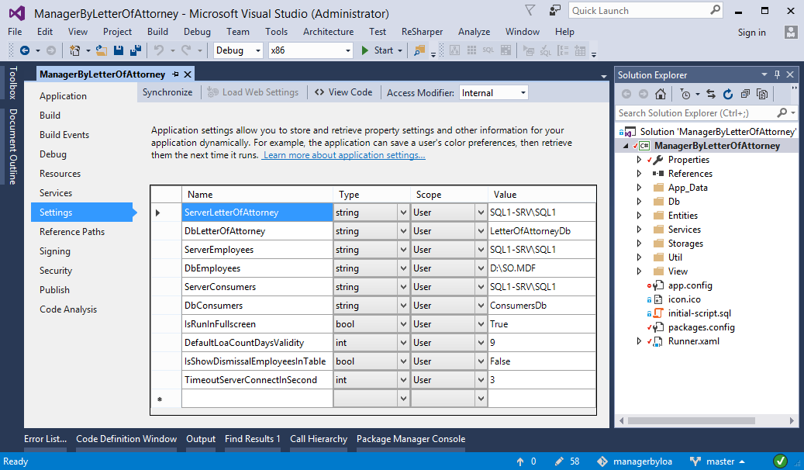
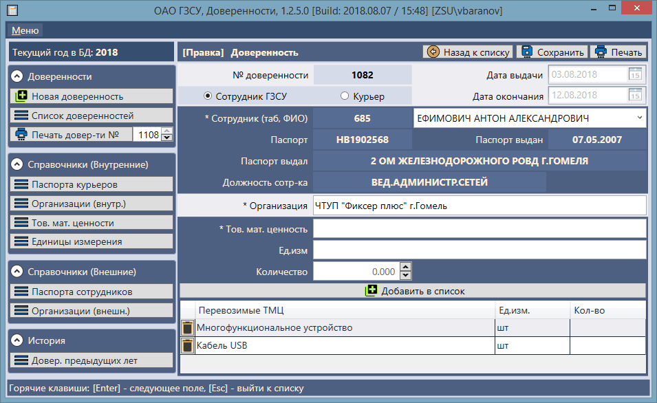
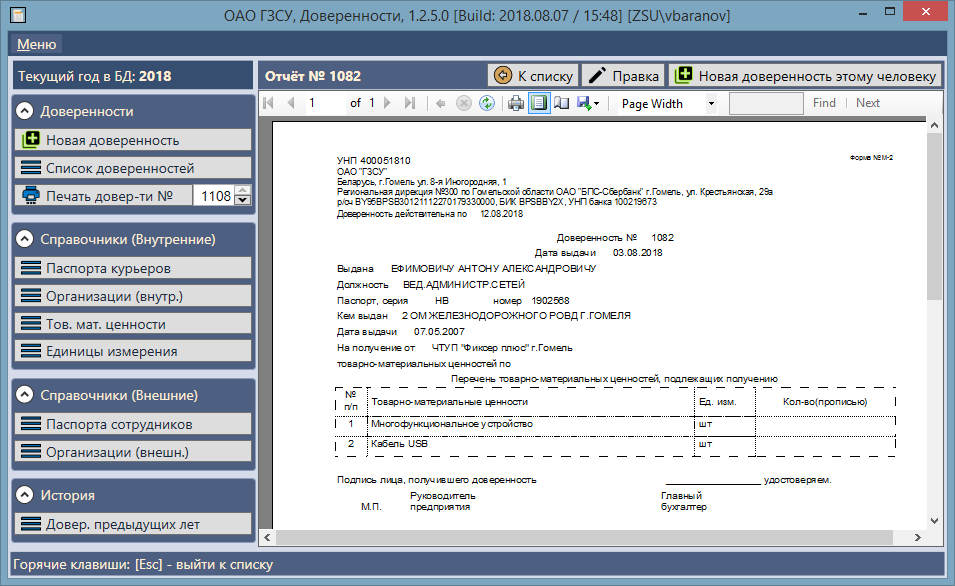

# ManagerByLOA

Рабочее название: *ManagerByLetterOfAttorney*  
Приложение **АРМ Доверенности** - десктоп-приложение для материального бюро бухгалтерии для выдачи доверенностей на перемещение товарно-материальных ценностей (грузов).

### Требуемые базы данных:  
- Внутренняя база данных этого приложения **[LetterOfAttorneyDb]** (версию для разработки можно инициализировать скриптом)  
- Внешняя база данных АРМ Отдела кадров **[D:\SO.MDF]** (это название, а не путь. легаси. Развернуть можно только из бэкапа)  
- Внешняя база данных АРМ Поставщиков-потребителей **[ConsumersDb]** (Развернуть можно только из бэкапа)  

### Параметры инициализации в IDE  
Параметры инициализации проекта на каждой машине разработчика (все файлы настроек описаны в .gitignore, дабы не перезатирать при каждом коммите): 

Параметр | Тип | Значение | Комментарий 
-------- | --- | -------- | -----------
ServerLetterOfAttorney          | string | SQL1-SRV\SQL1      | MSSQL-сервер с базой данных доверенностей 
DbLetterOfAttorney              | string | LetterOfAttorneyDb | База данных доверенностей 
ServerEmployees                 | string | SQL1-SRV\SQL1      | MSSQL-сервер с базой данных отдела кадров 
DbEmployees                     | string | D:\SO.MDF          | База данных отдела кадров 
ServerConsumers                 | string | SQL1-SRV\SQL1      | MSSQL-сервер с базой данных поставщиков-потребителей 
DbConsumers                     | string | ConsumersDb        | База данных поставщиков-потребителей 
IsRunInFullscreen               | bool   | True               | Признак запуска приложения в полноэкранном режиме 
DefaultLoaCountDaysValidity     | int    | 9                  | Число дней действия доверенности по умолчанию 
IsShowDismissalEmployeesInTable | bool   | False              | Признак отображения в таблице просмотра уволенных сотрудников 
TimeoutServerConnectInSecond    | int    | 3                  | Таймаут ответа от сервера (в секундах) 

### Скриншоты окна настроек и рабочего приложения  

  

  

  